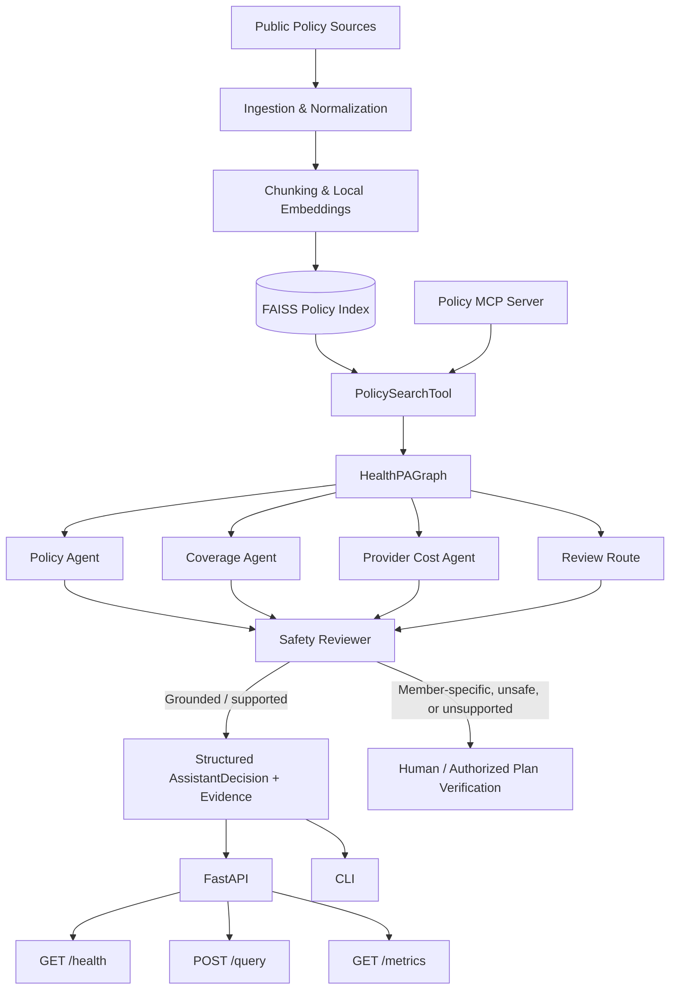

# HealthPA Agentic AI — Architecture

## Status

HealthPA is an **end-to-end local/demo MVP** for evidence-first healthcare policy assistance. The primary runtime is implemented under `src/elevance_ai/` and is exercised through FastAPI, the CLI, tests, and policy, pricing, and CMS-scope MCP servers. It deliberately stops short of making member-specific approval, denial, benefit, or price determinations.

A separate legacy/experimental CMS RAG + AWS Bedrock implementation remains under `src/graph/`, `src/rag/`, and `src/llm/` for research. It is not required by the primary MVP.

## Primary Runtime

## Components

### Ingestion and retrieval
Public policy/catalog content is normalized, chunked, embedded, and stored in FAISS. `PolicySearchTool` retrieves evidence with market and line-of-business filters.

### Agent routing
The primary `HealthPAGraph` routes questions into policy, member-coverage, provider-cost, or review behavior. The local MVP intentionally uses deterministic routing so its safety behavior is testable and does not depend on an LLM to decide whether sensitive member-specific questions should be escalated.

### Policy agent
The policy agent returns structured public-policy evidence. Evidence is guidance, not a final benefit or authorization determination.

### Coverage and cost boundaries
Member-specific benefit/claim questions are escalated. Provider-cost questions can use normalized public negotiated-rate observations when available; unsupported or member-specific cost questions are escalated. The system does not fabricate eligibility, coverage, prices, or authorization outcomes when the required source system is unavailable.

### Reviewer
The reviewer detects final-decision language such as approval/denial claims and downgrades the response to human review with plan verification guidance.

### MCP
The primary package exposes three stdio MCP surfaces: grounded policy search, normalized public pricing lookup, and CMS public-source scope guidance. These tools reuse the same domain/tool layer as the API and CLI rather than duplicating business logic.

### API
FastAPI provides:
- `GET /health` for service/configuration health
- `GET /metrics` for non-sensitive process-local aggregate counters
- `POST /query` for the reviewed HealthPA decision flow

### Observability
The local MVP records aggregate query count, selected route, and decision status. It intentionally does not record question text or member data in this metric layer.

### Testing and CI
Unit tests cover retrieval, routing/review, API contracts, safety behavior, and observability. Integration/evaluation tests provide smoke and safety checks. GitHub Actions installs the package, runs pytest, and enforces Ruff linting.

### Containerization
The Dockerfile packages the FastAPI runtime with Python 3.12 and Uvicorn. This demonstrates a deployable container artifact; it does not claim that a production cloud environment is currently running.

## Safety Boundary

HealthPA is not a medical device or autonomous utilization-management system. Public policy evidence cannot establish a member's active benefits, eligibility, claims state, contractual provider rate, or final authorization outcome. Those questions require authorized source systems and/or human review.

The architecture therefore favors abstention/escalation over unsupported certainty.

## Optional Experimental Track

The legacy CMS/LangGraph/RAG code demonstrates richer LLM-oriented experimentation, including AWS Bedrock/Amazon Nova Lite. It is retained for learning and future integration but is intentionally separated from the tested primary MVP until its external dependencies and operational boundary are defined.

## Production Extensions Not Claimed

A production deployment would still require authenticated payer/member integrations, production-scale pricing ingestion/storage, IAM and authorization, PHI/security controls, secret management, durable audit logs, production telemetry/tracing, SLOs, resilience controls, and infrastructure configured for a specific cloud runtime. Terraform and additional CMS/pricing/voice adapters should be completed only against real deployment requirements rather than mocked as production integrations.
